<!-- markdownlint-disable MD033 MD060 -->

<div dir="rtl" lang="ar">

<p align="center">
  
</p>

<h1 align="center">حساب — Hisab</h1>

<p align="center">
  <strong>قسّموا المصاريف. صفّوا الحسابات. واصِلوا بلا اتصال.</strong><br/>
  تطبيق لتقسيم مصاريف المجموعات وتصفية الحسابات<br/>
  في الرحلات والنزهات والسكن المشترك — مع ميزانيات شخصية.<br/>
  <span dir="ltr">Flutter</span> · يعمل أوفلاين · مزامنة اختيارية عبر <span dir="ltr">Supabase</span>.
</p>

<p align="center">
  <a href="https://github.com/Zyzto/Hisab/releases/latest"></a>
  <a href="https://github.com/Zyzto/Hisab"></a>
  <a href="https://hisab.shenepoy.com"></a>
  <a href="https://apps.obtainium.imranr.dev/redirect.html?r=obtainium://add/https://github.com/Zyzto/Hisab/releases"></a>
  
  
</p>

<p align="center">
  <a href="https://hisab.shenepoy.com"><strong>افتح التطبيق على الويب</strong></a>
  ·
  <a href="https://github.com/Zyzto/Hisab/releases/latest">آخر إصدار</a>
  ·
  <a href="docs/README.md">الوثائق</a>
</p>

<p align="center">
  <a href="#ماذا-تقدّم">ماذا تقدّم؟</a> ·
  <a href="#لقطات">لقطات</a> ·
  <a href="#التثبيت">التثبيت</a> ·
  <a href="#التطوير">التطوير</a> ·
  <a href="#الوثائق">الوثائق</a>
  <br/>
  <a href="README.md"><span dir="ltr">English</span></a>
</p>

<p align="center">
  الاسم من العربية: <strong>حساب</strong>
  (<span dir="ltr"><em>ḥisāb</em></span>) — الحساب / التصفية / من عليه لمن.<br/>
  والاسم اللاتيني <span dir="ltr"><strong>Hisab</strong></span> مأخوذ منه.
</p>

</div>

---

<div dir="rtl" lang="ar">

## ماذا تقدّم؟

| | |
|---|---|
| **المجموعات والأشخاص** | رحلات أو نزهات أو سكن مشترك — مع ربط المشاركين بحسابات حقيقية عند الاتصال. |
| **المصاريف** | عملات متعددة، تصنيفات، إيصالات، تقسيم بالتساوي / حصص / مبالغ محددة، وتحويلات. |
| **الرصيد والتصفية** | من عليه لمن، اقتراحات بأقل دفعات ممكنة، وتسجيل الدفعات بضغطة. |
| **الملف الشخصي** | لوحة عبر المجموعات: الأرصدة، الإحصاءات، ميزانيات شخصية، ونشاط داخل التطبيق (متصل). |
| **قوائم شخصية** | تتبّع مصاريف وميزانية لك وحدك (دون واجهة تقسيم)؛ ومسودة اختيارية من ماسح إشعارات أندرويد. |
| **أوفلاين أولاً** | قاعدة محلية كاملة بـ <span dir="ltr">SQLite</span>. المزامنة والدعوات والأعضاء عند ربط <span dir="ltr">Supabase</span>. |
| **اللغات** | الإنجليزية والعربية (من اليمين إلى اليسار)، وثيمات، وضبط خفيف للّون المميّز. |

**الأوضاع**

| الوضع | البيانات | إضافي |
|------|------|--------|
| **محلي فقط** (الافتراضي) | <span dir="ltr">SQLite</span> على الجهاز | كل شيء ما عدا تسجيل الدخول والمزامنة بين الأجهزة |
| **متصل** | <span dir="ltr">Supabase</span> + كاش محلي | دعوات، أعضاء، إشعارات فورية، أجهزة متعددة |

إن انقطع الاتصال وأنت في الوضع المتصل: تُصفّ كتابة المصاريف وتُزامَن لاحقًا. الدعوات وإدارة الأعضاء تحتاج اتصالًا.

</div>

---

<div dir="rtl" lang="ar">

## لقطات

### الترحيب

<p align="center">
  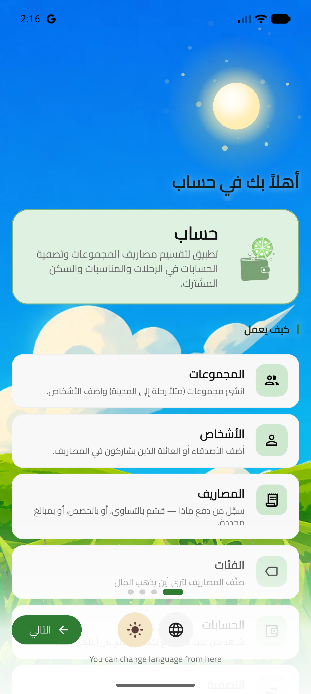
  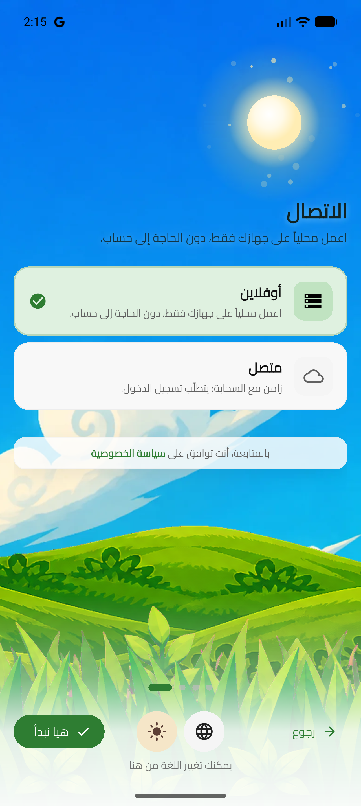
</p>

<p align="center">
  <sub>الترحيب · الاتصال (محلي فقط)</sub>
</p>

### المجموعات والمصاريف

<p align="center">
  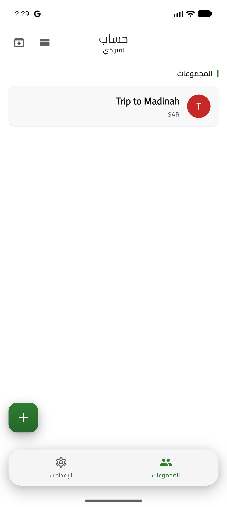
  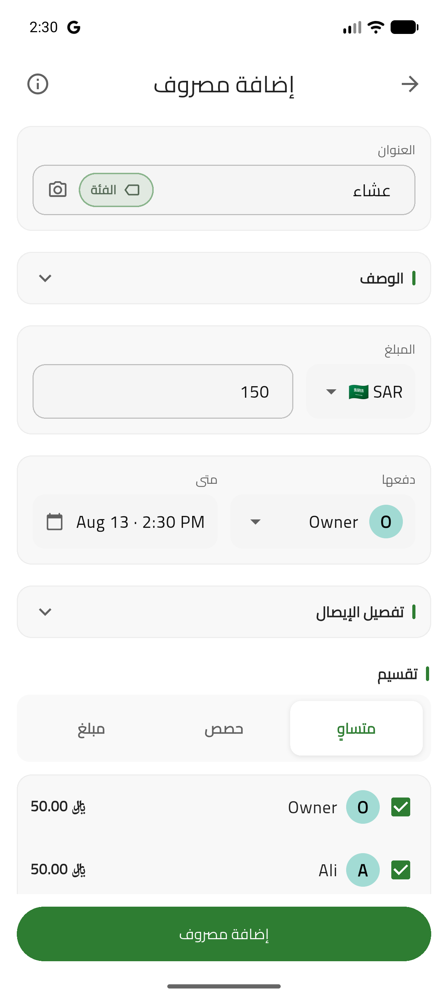
  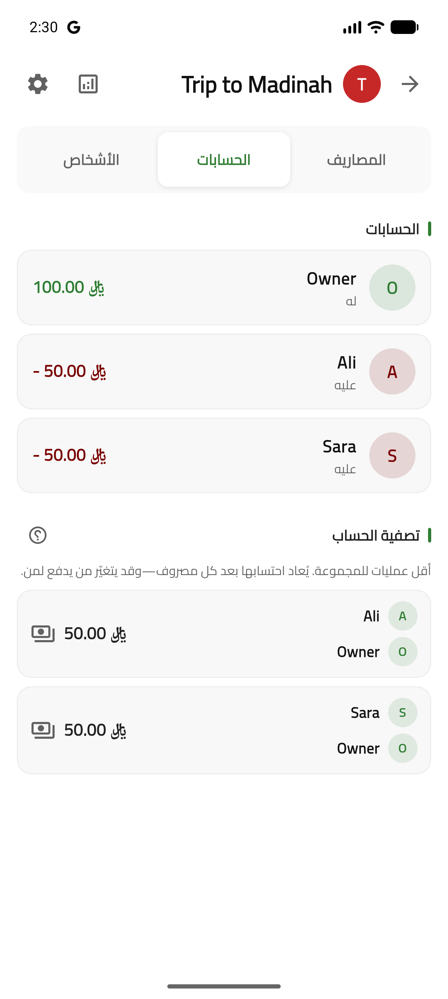
</p>

<p align="center">
  <sub>المجموعات · إضافة مصروف · تصفية الحساب</sub>
</p>

### عرض

<p align="center">
  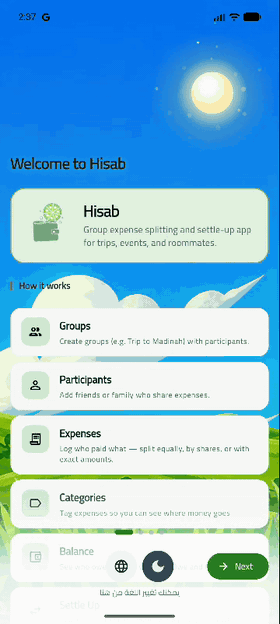
  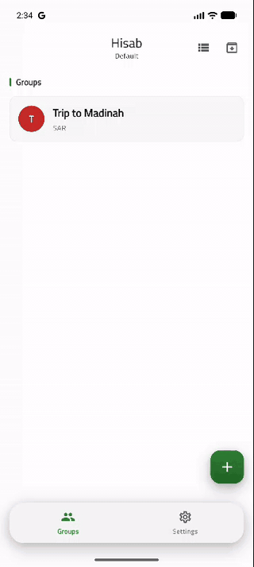
</p>

<p align="center">
  <sub>الترحيب · فتح مجموعة، إضافة مصروف، التصفية</sub>
</p>

<details>
<summary>السمة الداكنة</summary>

<p align="center">
  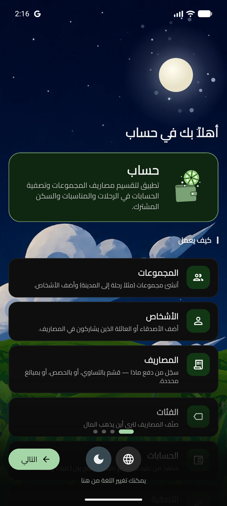
  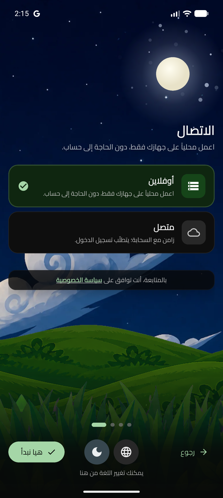
  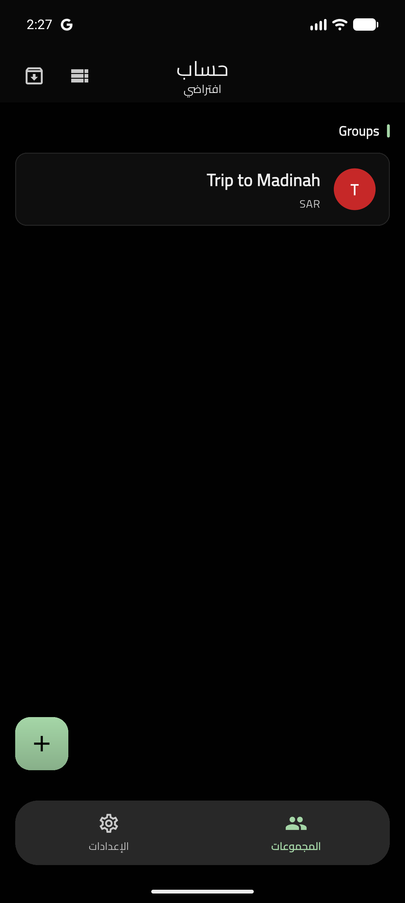
  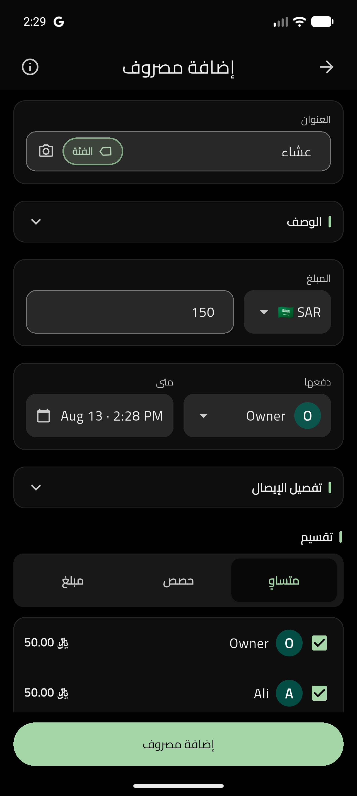
  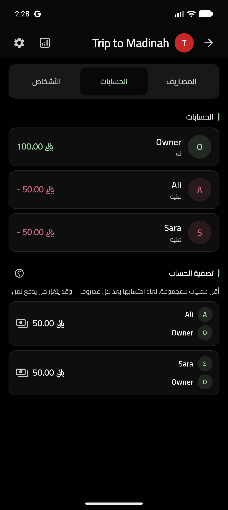
</p>

<p align="center">
  <sub>الترحيب · الاتصال · المجموعات · إضافة مصروف · تصفية الحساب</sub>
</p>

</details>

</div>

---

<div dir="rtl" lang="ar">

## التثبيت

### الويب / <span dir="ltr">PWA</span>

مباشر على **[hisab.shenepoy.com](https://hisab.shenepoy.com)** (<span dir="ltr">Firebase Hosting</span>).  
ثبّته من بانر التطبيق عند ظهوره (كروم أندرويد يستخدم طلب التثبيت الأصلي؛ آيفون وآيباد والمتصفحات الأخرى عبر «إضافة للشاشة الرئيسية»). على iOS افتح تطبيق الشاشة الرئيسية لدعم إشعارات الويب. يعمل أوفلاين بعد التثبيت.

### أندرويد

| الخيار | |
|--------|--|
| **<span dir="ltr">Obtainium</span>** (موصى به) | [](https://apps.obtainium.imranr.dev/redirect.html?r=obtainium://add/https://github.com/Zyzto/Hisab/releases) — يتابع [إصدارات GitHub](https://github.com/Zyzto/Hisab/releases) |
| **<span dir="ltr">APK</span>** | حمّل <span dir="ltr">`app-release.apk`</span> من [آخر إصدار](https://github.com/Zyzto/Hisab/releases/latest) |
| **متجر Play** | [الصفحة](https://play.google.com/store/apps/details?id=com.shenepoy.hisab) (قيد الإعداد / عند النشر) |

</div>

---

<div dir="rtl" lang="ar">

## التطوير

**المتطلبات:** <span dir="ltr">Flutter / Dart `^3.11`</span>

```bash
flutter pub get
dart run build_runner build --delete-conflicting-outputs
flutter run
```

بدون <span dir="ltr">`--dart-define`</span> → وضع **محلي فقط**.

**متصل (<span dir="ltr">Supabase</span> مستضاف):**

```bash
flutter run \
  --dart-define=SUPABASE_URL=https://YOUR_PROJECT.supabase.co \
  --dart-define=SUPABASE_ANON_KEY=YOUR_ANON_KEY
```

أو ملفات التعريفات (مستبعدة من Git): انسخ <span dir="ltr">`dart_defines_online.example.json`</span> / <span dir="ltr">`dart_defines_local.example.json`</span> ثم شغّل بـ <span dir="ltr">`--dart-define-from-file=...`</span> (انظر <span dir="ltr">`.vscode/launch.json`</span>).

**الويب:** ولّد <span dir="ltr">WASM</span> مرة إن لزم:

```bash
flutter pub run powersync:setup_web
```

**بيئة محلية أوفى** (<span dir="ltr">Supabase</span> + Edge Functions على الشبكة المحلية):

```bash
./scripts/local_test_env.sh up
```

التفاصيل: [docs/LOCAL_TEST_ENV.md](docs/LOCAL_TEST_ENV.md) · [docs/CONFIGURATION.md](docs/CONFIGURATION.md) · [docs/SUPABASE_SETUP.md](docs/SUPABASE_SETUP.md)

### حلول سريعة

| المشكلة | الحل |
|-------|-----|
| يبقى محليًا فقط | مرّر <span dir="ltr">`SUPABASE_URL`</span> و <span dir="ltr">`SUPABASE_ANON_KEY`</span> معًا |
| تعطل <span dir="ltr">SQLite</span> على الويب | <span dir="ltr">`flutter pub run powersync:setup_web`</span> |
| فشل تحويل <span dir="ltr">OAuth</span> | طابق عناوين إعادة التوجيه في <span dir="ltr">Supabase Auth</span> مع التطبيق / <span dir="ltr">`SITE_URL`</span> |
| أخطاء الترحيل | شبكة مستقرة؛ الترحيلات idempotent — انظر وثائق إعداد Supabase |

</div>

---

<div dir="rtl" lang="ar">

## البنية (باختصار)

- **الواجهة / الحالة** — <span dir="ltr">Flutter</span>، <span dir="ltr">Riverpod 3</span> (codegen)، <span dir="ltr">GoRouter</span>
- **قاعدة محلية** — <span dir="ltr">SQLite</span> عبر حزمة <span dir="ltr">PowerSync</span> (دائمًا)
- **السحابة** — <span dir="ltr">Supabase</span> اختياري (Auth، Postgres، RPCs، Edge Functions)
- **المزامنة** — الكتابة أونلاين إلى Supabase ثم الكاش؛ القراءة من SQLite؛ طابور عند انقطاع النت
- **المجال** — مجموعات، مشاركون، مصاريف (بالسنت)، أرصدة، تصفيات، دعوات

خريطة أعمق: [docs/CODEBASE.md](docs/CODEBASE.md)

</div>

---

<div dir="rtl" lang="ar">

## الوثائق

| الدليل | |
|-------|--|
| [فهرس الوثائق](docs/README.md) | كل المواضيع |
| [الإعداد](docs/CONFIGURATION.md) | <span dir="ltr">`--dart-define`</span>، متصل مقابل محلي |
| [إعداد Supabase](docs/SUPABASE_SETUP.md) | المشروع، الترحيلات، المصادقة، Edge Functions |
| [بيئة الاختبار المحلية](docs/LOCAL_TEST_ENV.md) | <span dir="ltr">Podman</span> / CLI للجهاز وEdge |
| [الأمان](SECURITY.md) | سياسة الأسرار للمستودع العام (ما لا يُرفع أبدًا) |
| [أسرار GitHub Actions](docs/GITHUB_ACTIONS_SECRETS.md) | أسماء أسرار CI/CD ومصادرها |
| [الاختبارات](test/README.md) | وحدة، ويدجت، تكامل، متصل |

</div>

---

<div dir="rtl" lang="ar">

## الاختبار

```bash
flutter test

# Local stack + Edge smoke
./scripts/local_test_env.sh up
./scripts/local_test_env.sh test-edge

# Online integration (Docker/Podman + Supabase CLI)
./scripts/run_online_tests.sh
```

<span dir="ltr">CI</span> يبني أندرويد، ينشر الويب، ويشغّل الاختبارات على وسوم <span dir="ltr">`v*`</span> / تشغيل يدوي (<span dir="ltr">`.github/workflows/release.yml`</span>). الأسرار في GitHub Actions — انظر [docs/GITHUB_ACTIONS_SECRETS.md](docs/GITHUB_ACTIONS_SECRETS.md)، وليس في هذا المستودع.

</div>

---

<div dir="rtl" lang="ar">

## المساهمة والأسرار

هذا المستودع **عام**. لا ترفع مفاتيح حقيقية، ولا ملفات حساب خدمة JSON، ولا ملفات define/env المعبأة. استخدم قوالب <span dir="ltr">`*_example`</span> و [SECURITY.md](SECURITY.md).

</div>

---

<div dir="rtl" lang="ar">

## الرخصة

[CC BY-NC-SA 4.0](https://creativecommons.org/licenses/by-nc-sa/4.0/) — مشاركة وتعديل مع الإسناد، **لغير الاستخدام التجاري** فقط، ونفس الرخصة للمشتقات.  
النص الكامل: [LICENSE](LICENSE).

</div>
