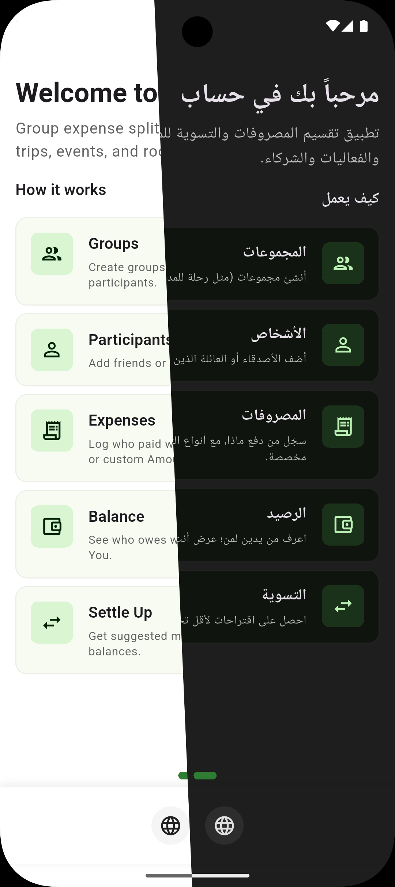
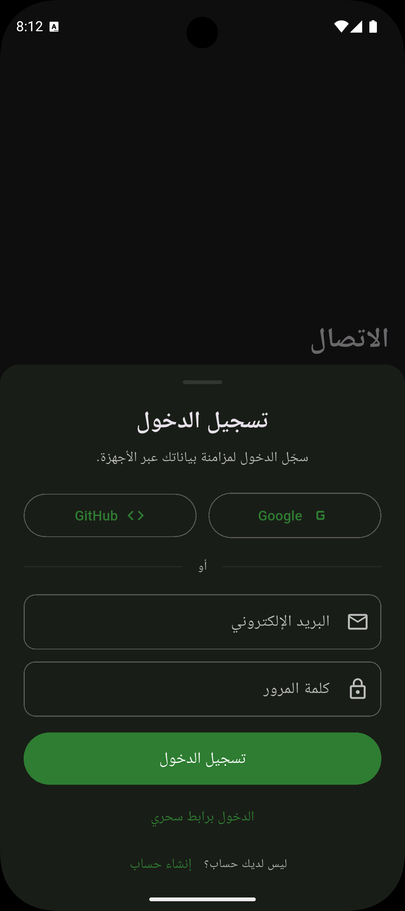
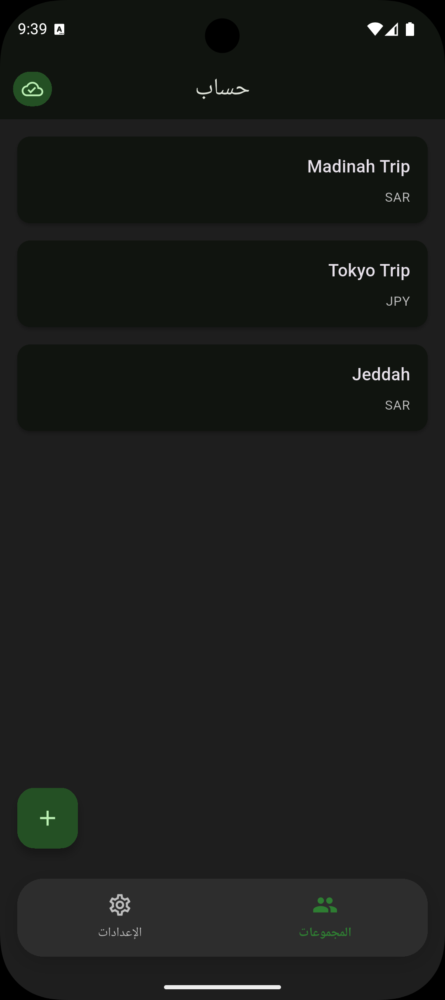
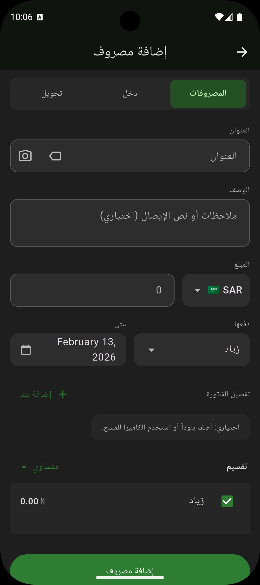

# Hisab


Group expense splitting and settle-up app. Built with Flutter, Riverpod, GoRouter, and Supabase.

## Features

- **Groups** — Create groups (trips/events) with participants.
- **Expenses** — Log multi-currency expenses with payer and split type (Equal, Parts, Amounts).
- **Balance** — View who is owed / who owes; settle-up suggests minimal transfers.
- **Record Settlement** — Tap a settlement suggestion to record the payment and zero out the debt.
- **Settings** — Theme, language, and **Local Only** toggle.
- **Offline-first** — Works entirely offline via local SQLite. Syncs directly with Supabase when online.

## Two Modes

| Mode | What works | Data location |
|------|-----------|---------------|
| **Local-Only** (default) | **Everything** — full CRUD, settlement, no restrictions | Local SQLite only |
| **Online** (with Supabase) | **Everything** + invites, members, cross-device sync | Supabase + local SQLite cache |

When in Online mode and temporarily offline, you can still add expenses (queued for later sync). Other features like invites and member management require connectivity.

## Screenshots

<details>
<summary>Click to expand/hide</summary>



</details>

## Install

### 🌐 Web / PWA

The app is deployed as a **Progressive Web App (PWA)**. It works locally and offline.
<h3>
  <a href="https://hisab.shenepoy.com">
    👉 Visit Hisab Web App
  </a>
</h3>

- **Install:** Add to Home Screen via Chrome, Edge, or Safari.
- **Offline:** Works perfectly without an internet connection.

#
### Android

**Option 1: Obtainium (Recommended) - Automatic Updates**

<a href="https://apps.obtainium.imranr.dev/redirect?r=obtainium://add/https://github.com/Zyzto/Hisab">

</a>

- **Manual Setup**: Install [Obtainium](https://github.com/ImranR98/Obtainium) from [F-Droid](https://f-droid.org/packages/com.imranr98.obtainium/) or [GitHub Releases](https://github.com/ImranR98/Obtainium/releases), then:
  - Open Obtainium and tap the "+" button
  - Select "GitHub Releases" as the source
  - Enter repository: `Zyzto/Hisab`
- Obtainium will automatically track new releases and notify you of updates

**Option 2: Google Play Store** **WIP**
- Available on [Google Play Store](https://play.google.com/store/apps/details?id=com.shenepoy.hisab) (when published)
- Automatic updates through Play Store

**Option 3: Direct Install (APK)**
- Download the APK (e.g. `app-release.apk`) from [GitHub Releases](https://github.com/Zyzto/Hisab/releases/latest)
- Enable "Install from unknown sources" in your Android settings
- Tap the downloaded APK file to install

## Requirements

- Flutter SDK ^3.10.0
- Dart ^3.10.0

## Run

```bash
flutter pub get
dart run build_runner build --delete-conflicting-outputs
flutter run
```

Without `--dart-define` parameters the app runs in **local-only mode** (no sign-in, no sync).

### Online mode

```bash
flutter run \
  --dart-define=SUPABASE_URL=https://xxxxx.supabase.co \
  --dart-define=SUPABASE_ANON_KEY=eyJhbGci...
```

For web: ensure `web/sqlite3.wasm` is present (it is generated locally and typically not committed). Generate it with:

```bash
dart run powersync:setup_web
```

## Architecture

- **State** — Riverpod 3 with `riverpod_annotation` codegen.
- **Navigation** — GoRouter with ShellRoute and bottom nav.
- **Data** — Repository pattern: `IGroupRepository`, `IParticipantRepository`, `IExpenseRepository`.
  - Local SQLite (via PowerSync package) is the single local database engine.
  - When online, writes go to Supabase first, then update local cache.
  - Reads always come from local SQLite for speed and reactivity.
  - Complex operations (invite accept, ownership transfer, etc.) use Supabase RPC functions.
- **Sync** — `DataSyncService` handles: full fetch from Supabase, push pending offline writes, periodic refresh.
- **Auth** — Supabase Auth (email/password, magic link, Google OAuth, GitHub OAuth).
- **Domain** — `lib/domain/`: Group, Participant, Expense (amounts in cents), SplitType, SettlementTransaction, and related types (e.g. GroupMember, GroupInvite, SettlementMethod, SettlementSnapshot).

## Supabase (optional)

For **online mode**, set up Supabase. See **[SUPABASE_SETUP.md](docs/SUPABASE_SETUP.md)** for the full step-by-step guide covering:

- Creating the Supabase project and applying database migrations
- Configuring authentication providers (email, Google, GitHub)
- Deploying Edge Functions (the repo includes `invite-redirect`; `telemetry` and `send-notification` are documented in setup docs and can be deployed from those definitions)
- Configuring `--dart-define` parameters

If no `--dart-define` values are provided, the app runs in **local-only mode** — all features work except sign-in and cross-device sync.

### Common issues

| Issue | Quick fix |
|-------|-----------|
| **App shows local-only mode** | Ensure both `--dart-define` params are set |
| **SQLite web crash** | Run `dart run powersync:setup_web` to download WASM |
| **OAuth redirect fails** | Check Supabase Auth redirect URLs match your app |
| **Migration fails** | Ensure stable internet; migration is idempotent |

Full configuration reference: [CONFIGURATION.md](docs/CONFIGURATION.md).

### Keeping secrets out of git

All secrets are provided at build time via `--dart-define` — nothing is committed to the repository. The only gitignored file for local secrets is `lib/core/constants/app_secrets.dart` (copy from `app_secrets_example.dart`); it holds the report-issue URL. All Supabase and Firebase values are provided via `--dart-define` only.

## CI/CD (GitHub Actions)

The project includes a release workflow (`.github/workflows/release.yml`) that builds Android APK/AAB, deploys to Google Play, and deploys the web app to Firebase Hosting. It triggers on version tags (`v*`) or manual dispatch.

### Required GitHub Secrets

Go to **repo Settings** → **Secrets and variables** → **Actions** and add each secret.

#### Supabase

| Secret | How to get it |
|--------|--------------|
| `SUPABASE_URL` | Supabase Dashboard → **Settings** → **API** → Project URL |
| `SUPABASE_ANON_KEY` | Supabase Dashboard → **Settings** → **API** → `anon` `public` key |
| `SITE_URL` | Your web app URL, e.g. `https://hisab.shenepoy.com` |

#### Firebase Hosting

| Secret | How to get it |
|--------|--------------|
| `FIREBASE_SERVICE_ACCOUNT` | Firebase Console → **Project Settings** → **Service accounts** → **Generate new private key** → paste the entire JSON |

#### Firebase / FCM (web push, optional for Android)

| Secret | How to get it |
|--------|--------------|
| `FCM_VAPID_KEY` | Firebase Console → **Project Settings** → **Cloud Messaging** → **Web Push certificates** → generate or copy the key pair's public key (required for web push token) |

#### Android Signing

Generate a keystore (one-time setup):

```bash
keytool -genkey -v \
  -keystore ~/hisab-release.jks \
  -keyalg RSA -keysize 2048 \
  -validity 10000 \
  -alias hisab-release
```

You will be prompted for a **store password** and a **key password** (press Enter at the key password prompt to reuse the store password).

Then base64-encode it:

```bash
base64 -w 0 ~/hisab-release.jks
```

Copy the keystore into the project for local signed builds (already gitignored):

```bash
cp ~/hisab-release.jks android/app/release-keystore.jks
```

| Secret | Value |
|--------|-------|
| `KEYSTORE_BASE64` | Output of `base64 -w 0 ~/hisab-release.jks` (entire string, no newlines) |
| `KEYSTORE_PASSWORD` | The store password you chose during `keytool` |
| `KEY_ALIAS` | `hisab-release` |
| `KEY_PASSWORD` | The key password (same as store password if you pressed Enter) |
| `GOOGLE_SERVICES_JSON` | Base64-encoded `android/app/google-services.json` (Firebase Console → **Project settings** → your Android app → download `google-services.json`, then `base64 -w 0 android/app/google-services.json`) |

#### Google Play (optional)

| Secret | How to get it |
|--------|--------------|
| `PLAY_STORE_SERVICE_ACCOUNT_JSON` | Google Play Console → **Setup** → **API access** → create/link a service account → download JSON key |

### Local key.properties (for local release builds)

Create `android/key.properties` (gitignored):

```properties
storeFile=/absolute/path/to/android/app/release-keystore.jks
storePassword=your_store_password
keyAlias=hisab-release
keyPassword=your_key_password
```

## License

This project is licensed under **Creative Commons Attribution-NonCommercial-ShareAlike 4.0 International (CC BY-NC-SA 4.0)**.

- You may **share** and **adapt** the material with **attribution**, for **non-commercial** use only, and you must **share adaptations** under the same license.
- Full legal text: [LICENSE](LICENSE) in this repo, or [legalcode](https://creativecommons.org/licenses/by-nc-sa/4.0/legalcode) on the CC site.
- Human-readable summary: [CC BY-NC-SA 4.0](https://creativecommons.org/licenses/by-nc-sa/4.0/).
