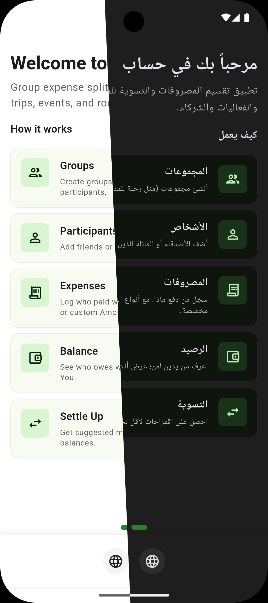
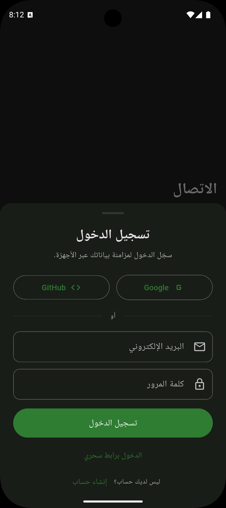
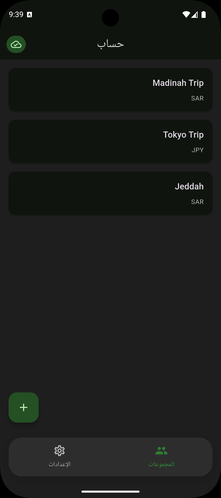
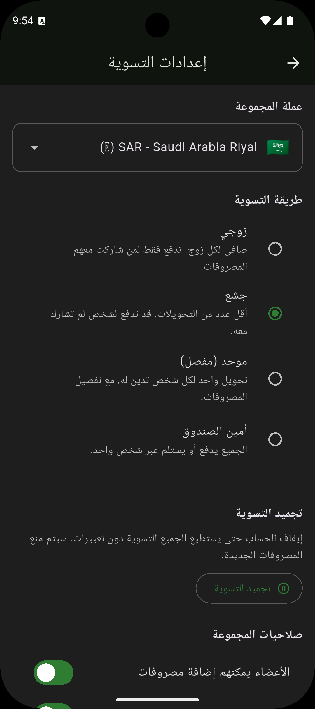
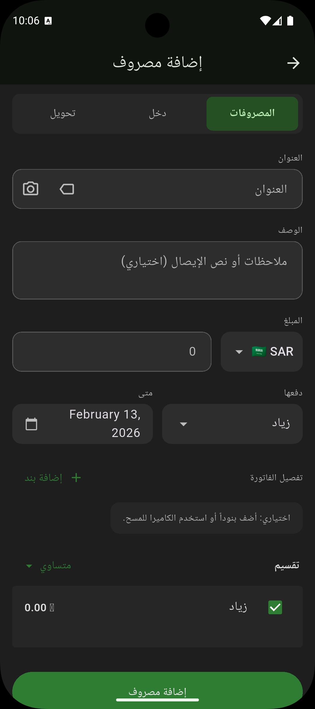

# Hisab

<!-- markdownlint-disable MD033 MD060 -->

<p align="center">
  
</p>

<p align="center">
  <strong>Split expenses. Settle cleanly. Work offline.</strong>
</p>

<p align="center">
  Shared trips, household costs, and personal budgets — with balances that stay clear<br/>
  when everyone chips in. Flutter · offline-first · optional Supabase sync.
</p>

<p align="center">
  <a href="https://hisab.shenepoy.com"><strong>Open the web app</strong></a>
  ·
  <a href="https://github.com/Zyzto/Hisab/releases/latest">Latest release</a>
  ·
  <a href="docs/README.md">Documentation</a>
</p>

---

## What you get

| | |
|---|---|
| **Groups & people** | Trips, events, or household lists — with participants linked to real accounts when online. |
| **Expenses** | Multi-currency amounts, categories, receipts, equal / parts / amounts splits, transfers. |
| **Balance & settle-up** | Who owes whom, minimal settlement suggestions, record payments in one tap. |
| **Personal lists** | Solo budgets and spending (no split UI); optional Android notification scanner drafts. |
| **Offline-first** | Full local SQLite. Sync, invites, and members when you connect Supabase. |
| **Locales** | English and Arabic (RTL), themes, and subtle accent controls. |

**Modes**

| Mode | Data | Extra |
|------|------|--------|
| **Local-only** (default) | Device SQLite | Everything except sign-in & cross-device sync |
| **Online** | Supabase + local cache | Invites, members, push, multi-device |

Temporarily offline in online mode: expense writes queue and sync later. Invites and member admin need a connection.

---

## Screenshots

<p align="center">
  
  
  
  
</p>

<p align="center">
  
</p>

<p align="center">
  
  
</p>

---

## Install

### Web / PWA

Live at **[hisab.shenepoy.com](https://hisab.shenepoy.com)** (Firebase Hosting).  
Add to Home Screen in Chrome, Edge, or Safari — works offline after install.

### Android

| Option | |
|--------|--|
| **Obtainium** (recommended) | [Add Hisab](https://apps.obtainium.imranr.dev/redirect?r=obtainium://add/https://github.com/Zyzto/Hisab) — tracks [GitHub Releases](https://github.com/Zyzto/Hisab/releases) |
| **APK** | Download `app-release.apk` from [latest release](https://github.com/Zyzto/Hisab/releases/latest) |
| **Play Store** | [Listing](https://play.google.com/store/apps/details?id=com.shenepoy.hisab) (WIP / when published) |

---

## Develop

**Requirements:** Flutter / Dart `^3.10`

```bash
flutter pub get
dart run build_runner build --delete-conflicting-outputs
flutter run
```

No `--dart-define` → **local-only** mode.

**Online (hosted Supabase):**

```bash
flutter run \
  --dart-define=SUPABASE_URL=https://YOUR_PROJECT.supabase.co \
  --dart-define=SUPABASE_ANON_KEY=YOUR_ANON_KEY
```

Or use define files (gitignored): copy `dart_defines_online.example.json` / `dart_defines_local.example.json`, then launch with `--dart-define-from-file=...` (see `.vscode/launch.json`).

**Web:** generate WASM once if needed:

```bash
dart run powersync:setup_web
```

**Fuller local stack** (Supabase + Edge Functions on LAN):

```bash
./scripts/local_test_env.sh up
```

Details: [docs/LOCAL_TEST_ENV.md](docs/LOCAL_TEST_ENV.md) · [docs/CONFIGURATION.md](docs/CONFIGURATION.md) · [docs/SUPABASE_SETUP.md](docs/SUPABASE_SETUP.md)

### Quick fixes

| Issue | Fix |
|-------|-----|
| Stays local-only | Pass both `SUPABASE_URL` and `SUPABASE_ANON_KEY` |
| SQLite crash on web | `dart run powersync:setup_web` |
| OAuth redirect fails | Align Supabase Auth redirect URLs with your app / `SITE_URL` |
| Migration errors | Stable network; migrations are idempotent — see Supabase setup docs |

---

## Architecture (short)

- **UI / state** — Flutter, Riverpod 3 (codegen), GoRouter  
- **Local DB** — SQLite via PowerSync package (always on)  
- **Cloud** — Optional Supabase (Auth, Postgres, RPCs, Edge Functions)  
- **Sync** — Online writes to Supabase then cache; reads from SQLite; pending queue when offline  
- **Domain** — Groups, participants, expenses (cents), balances, settlements, invites  

Deeper map: [docs/CODEBASE.md](docs/CODEBASE.md)

---

## Docs

| Guide | |
|-------|--|
| [Documentation index](docs/README.md) | All topics |
| [Configuration](docs/CONFIGURATION.md) | `--dart-define`, online vs local |
| [Supabase setup](docs/SUPABASE_SETUP.md) | Project, migrations, auth, Edge Functions |
| [Local test env](docs/LOCAL_TEST_ENV.md) | Podman / CLI stack for device + Edge tests |
| [Security](SECURITY.md) | Public-repo secret policy (what never to commit) |
| [GitHub Actions secrets](docs/GITHUB_ACTIONS_SECRETS.md) | CI/CD secret names and sources |
| [Tests](test/README.md) | Unit, widget, integration, online |

---

## Testing

```bash
flutter test

# Local stack + Edge smoke
./scripts/local_test_env.sh up
./scripts/local_test_env.sh test-edge

# Online integration (Docker/Podman + Supabase CLI)
./scripts/run_online_tests.sh
```

CI builds Android, deploys web, and runs tests on tags `v*` / manual dispatch (`.github/workflows/release.yml`). Secrets live in GitHub Actions — see [docs/GITHUB_ACTIONS_SECRETS.md](docs/GITHUB_ACTIONS_SECRETS.md), not in this repo.

---

## Contributing & secrets

This repository is **public**. Never commit real keys, service-account JSON, or filled define/env files. Use `*_example` templates and [SECURITY.md](SECURITY.md).

---

## License

[CC BY-NC-SA 4.0](https://creativecommons.org/licenses/by-nc-sa/4.0/) — share and adapt with attribution, **non-commercial** only, same license for derivatives.  
Full text: [LICENSE](LICENSE).
