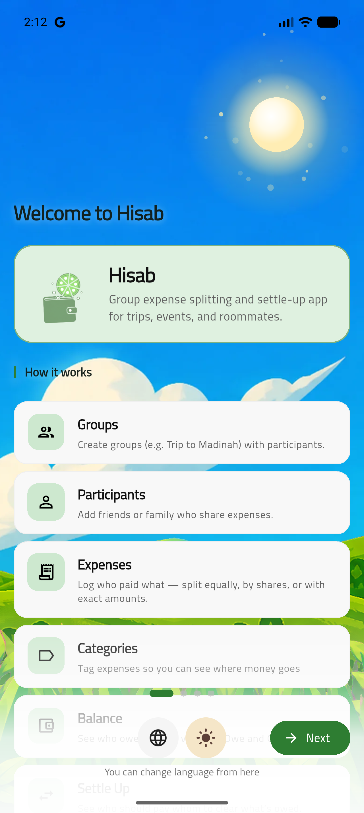
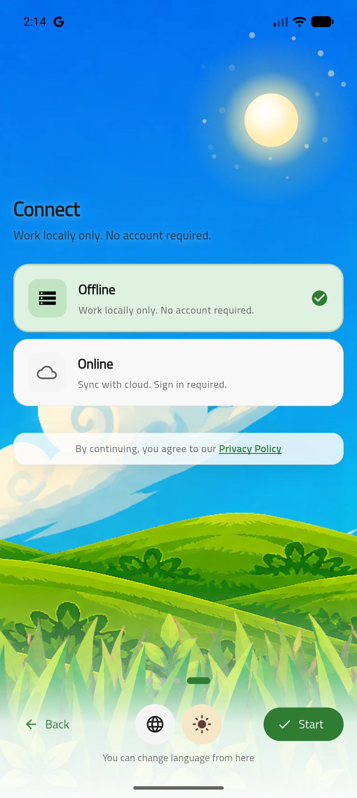
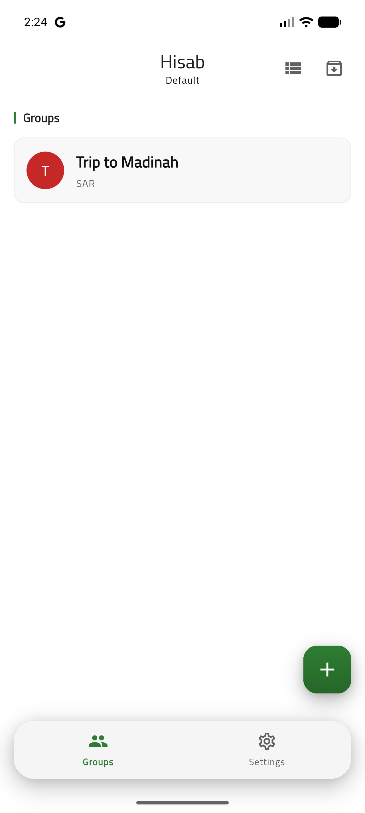
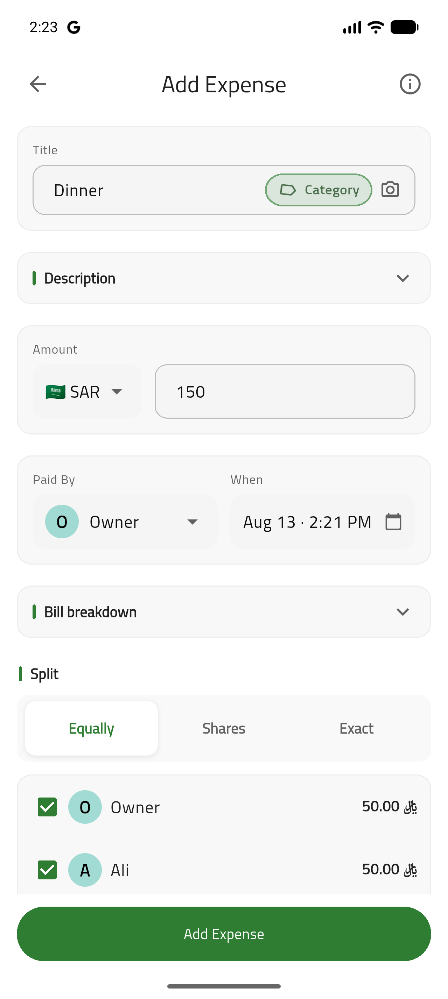
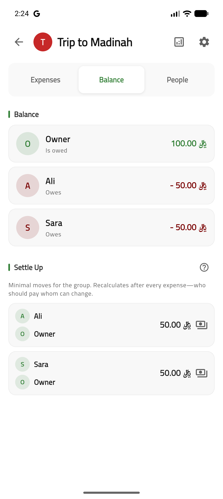
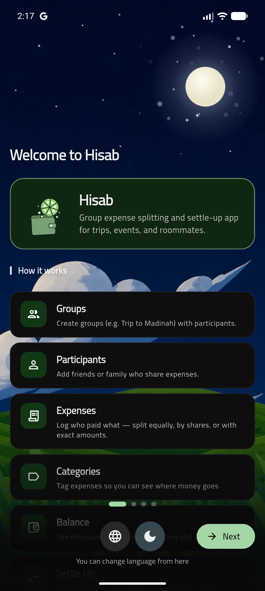
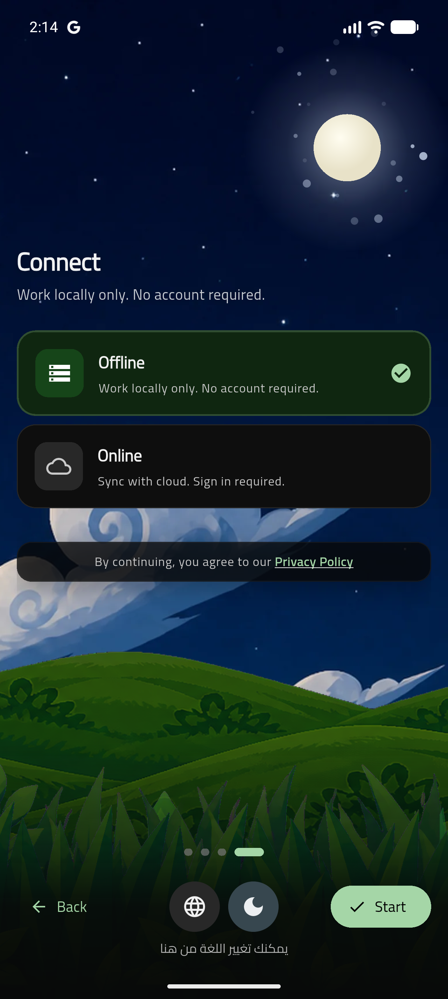
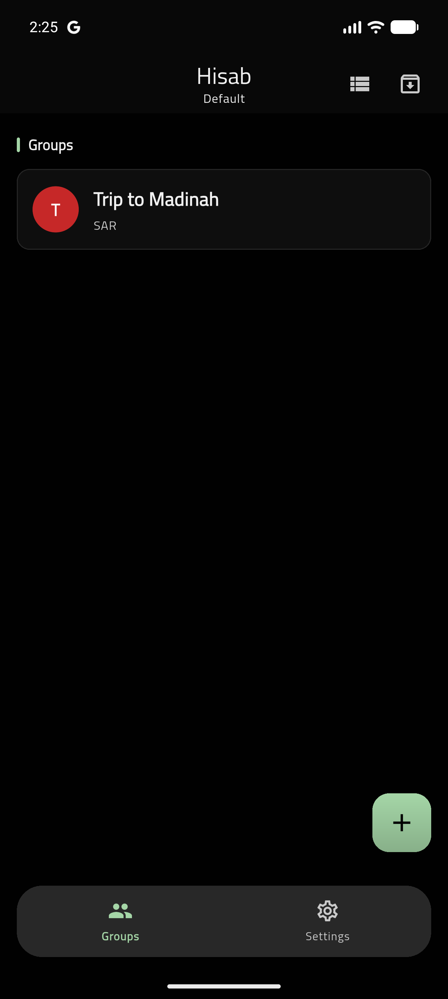
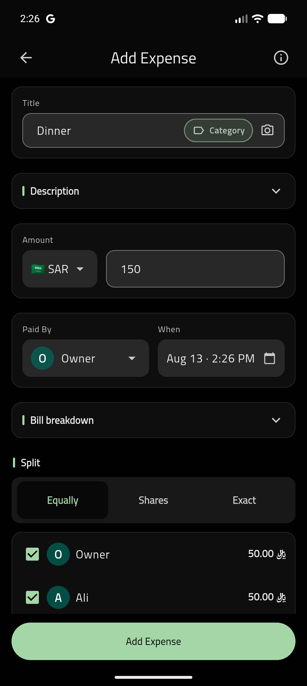
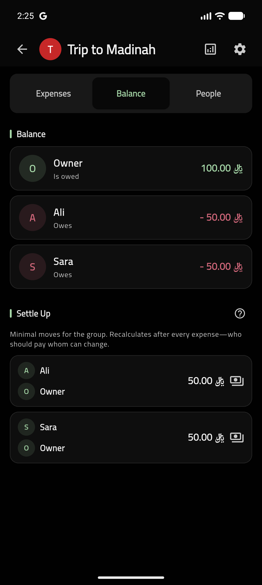

<!-- markdownlint-disable MD033 MD060 -->

<p align="center">
  
</p>

<h1 align="center">Hisab - حساب</h1>

<p align="center">
  <strong>Split expenses. Settle cleanly. Work offline.</strong><br/>
  Shared trips, household costs, and personal budgets — with balances that stay clear<br/>
  when everyone chips in. Flutter · offline-first · optional cloud sync.
</p>

<p align="center">
  <a href="https://github.com/Zyzto/Hisab/releases/latest"></a>
  <a href="https://github.com/Zyzto/Hisab"></a>
  <a href="https://hisab.shenepoy.com"></a>
  <a href="https://apps.obtainium.imranr.dev/redirect.html?r=obtainium://add/https://github.com/Zyzto/Hisab/releases"></a>
  
  <a href="LICENSE"></a>
</p>

<p align="center">
  <a href="https://hisab.shenepoy.com"><strong>Open the web app</strong></a>
  ·
  <a href="https://github.com/Zyzto/Hisab/releases/latest">Latest release</a>
  ·
  <a href="docs/README.md">Documentation</a>
</p>

<p align="center">
  <a href="#what-you-get">What you get</a> ·
  <a href="#screenshots">Screenshots</a> ·
  <a href="#install">Install</a> ·
  <a href="#develop">Develop</a> ·
  <a href="#docs">Docs</a> ·
  <a href="README.ar.md">العربية</a>
</p>

<p align="center">
  The name <strong>Hisab</strong> comes from Arabic
  <span dir="rtl"><strong>حساب</strong></span>
  (<em>ḥisāb</em>): account / reckoning —
  settling who owes whom.
</p>

---

## What you get

| | |
|---|---|
| **Groups & people** | Trips, events, or household lists — with participants linked to real accounts when online. |
| **Expenses** | Multi-currency amounts, categories, receipts, equally / shares / exact-amount splits, transfers. |
| **Balance & settle-up** | Who owes whom, minimal settlement suggestions, record payments in one tap. |
| **Profile** | Cross-group dashboard: net balances, KPIs, personal budgets, and an in-app activity feed (online). |
| **Personal lists** | Solo budgets and spending (no split UI); optional Android notification scanner drafts. |
| **Offline-first** | Full local SQLite. Sync, invites, and members when a backend is attached. |
| **Locales** | English and Arabic (RTL), themes, and subtle accent controls. |

**Modes**

| Mode | Data | Extra |
|------|------|--------|
| **Local-only** (default) | Device SQLite | Everything except sign-in & cross-device sync |
| **Online** | Cloud backend + local cache | Invites, members, push, multi-device |

Temporarily offline in online mode: expense writes queue and sync later. Invites and member admin need a connection.

---

## Screenshots

### Onboarding

<p align="center">
  
  
</p>

<p align="center">
  <sub>Welcome · Connection (local-only)</sub>
</p>

### Groups & expenses

<p align="center">
  
  
  
</p>

<p align="center">
  <sub>Groups · Add expense · Settlement</sub>
</p>

### Demo

<p align="center">
  
  
</p>

<p align="center">
  <sub>Onboarding · Open a group, add an expense, settle</sub>
</p>

<details>
<summary>Dark theme</summary>

<p align="center">
  
  
  
  
  
</p>

<p align="center">
  <sub>Welcome · Connection · Groups · Add expense · Settlement</sub>
</p>

</details>

---

## Two builds

Hisab is open core. This repository is the whole client, and it builds a
complete offline app with no backend at all. The hosted sync service that
powers invites, shared groups and multi-device is a separate proprietary
project, and it plugs in behind an interface that lives here in
[`packages/hisab_backend`](packages/hisab_backend).

| | **FOSS** | **Cloud** |
|---|---|---|
| Built from | this repository, alone | this repository + a private backend package |
| Backend | none | hosted Supabase |
| Application id | `com.shenepoy.hisab.foss` | `com.shenepoy.hisab` |
| Groups, expenses, balances, settle-up, budgets, receipts | yes | yes |
| Sign-in, invites, shared groups, push, multi-device | no | yes |
| Licence | AGPL-3.0 | AGPL-3.0 client, proprietary backend |

Both are published on the same [releases page](https://github.com/Zyzto/Hisab/releases/latest),
and they install side by side, so trying one does not overwrite the other.

You are not limited to those two. The backend is an interface, not a vendor:
implement it against your own server and you get a third build that is yours
end to end. [docs/SELF_HOSTING.md](docs/SELF_HOSTING.md) is the specification,
and [docs/BACKEND_BEHAVIOUR.md](docs/BACKEND_BEHAVIOUR.md) documents the
server-side behaviour the client expects.

---

## Install

### Web / PWA

Live at **[hisab.shenepoy.com](https://hisab.shenepoy.com)** (Firebase Hosting) — this is the cloud build.  
Install from the in-app banner when offered (Chromium Android uses the native install prompt; iPhone/iPad and other mobile browsers get Add-to-Home-Screen steps). On iOS, open the Home Screen app for web push. Works offline after install.

### Android

| Option | |
|--------|--|
| **Obtainium** (recommended) | [](https://apps.obtainium.imranr.dev/redirect.html?r=obtainium://add/https://github.com/Zyzto/Hisab/releases) — tracks [GitHub Releases](https://github.com/Zyzto/Hisab/releases) |
| **APK, cloud build** | `cloud-<abi>-release.apk` from the [latest release](https://github.com/Zyzto/Hisab/releases/latest) |
| **APK, FOSS build** | `app-<abi>-foss-release.apk` from the same release — offline only, built entirely from this repository |
| **Play Store** | [Listing](https://play.google.com/store/apps/details?id=com.shenepoy.hisab) (WIP / when published) |

Pick `arm64-v8a` unless you know your device is older.

---

## Develop

**Requirements:** Flutter / Dart `^3.11`

```bash
flutter pub get
dart run build_runner build --delete-conflicting-outputs
flutter run
```

That is the whole setup. There is no backend to configure, no keys to obtain,
and no `--dart-define` to pass — the checked-in `packages/hisab_cloud` is a
no-op stub, so the app runs **local-only** and every feature that does not
inherently need a server works.

**Web:** generate WASM once if needed:

```bash
flutter pub run powersync:setup_web
```

**Android:** the `foss` flavor is the offline one and the default for
development:

```bash
flutter run --flavor foss
```

### Attaching a backend

Implement the `CloudBackend` contract in a package of your own and point
`pubspec_overrides.yaml` at it:

```yaml
dependency_overrides:
  hisab_cloud:
    path: ../my_hisab_cloud
```

The app calls `registerHisabCloud()` at startup; if your implementation
registers a backend, sign-in, sync, invites and push light up, and if it does
not, the app stays local-only. Nothing else in `lib/` changes.

Full walkthrough: [docs/SELF_HOSTING.md](docs/SELF_HOSTING.md) ·
contract reference: [packages/hisab_backend/README.md](packages/hisab_backend/README.md) ·
server-side expectations: [docs/BACKEND_BEHAVIOUR.md](docs/BACKEND_BEHAVIOUR.md)

### Quick fixes

| Issue | Fix |
|-------|-----|
| Stays local-only | Expected without a backend package — see *Attaching a backend* |
| SQLite crash on web | `flutter pub run powersync:setup_web` |
| Android build cannot find a flavor | Pass `--flavor foss` (or `cloud` if you supply a backend) |
| Riverpod / codegen errors after a pull | `dart run build_runner build --delete-conflicting-outputs` |

---

## Architecture (short)

- **UI / state** — Flutter, Riverpod 3 (codegen), GoRouter  
- **Local DB** — SQLite via PowerSync package (always on)  
- **Cloud** — Optional, behind the `CloudBackend` contract; absent by default  
- **Sync** — Online writes go to the backend then the cache; reads always come from SQLite; a pending queue drains when connectivity returns  
- **Domain** — Groups, participants, expenses (cents), balances, settlements, invites  

Deeper map: [docs/CODEBASE.md](docs/CODEBASE.md)

---

## Docs

| Guide | |
|-------|--|
| [Documentation index](docs/README.md) | All topics |
| [Self-hosting](docs/SELF_HOSTING.md) | Implement the contract against your own server |
| [Backend behaviour](docs/BACKEND_BEHAVIOUR.md) | Server-side rules the client relies on |
| [Backend contract](packages/hisab_backend/README.md) | Facet-by-facet API reference |
| [Configuration](docs/CONFIGURATION.md) | Build-time flags, online vs local |
| [Security](SECURITY.md) | Public-repo secret policy (what never to commit) |
| [Contributing](CONTRIBUTING.md) | Workflow and the CLA |
| [Tests](test/README.md) | Unit, widget, integration |

---

## Testing

```bash
flutter test
bash scripts/run_release_checks.sh
```

CI runs the checks, the test suite and an **offline build guard** that asserts
this tree still builds with no backend attached
(`.github/workflows/ci.yml`). Tagging `v*` builds and publishes the signed FOSS
APKs (`.github/workflows/release.yml`). No production credentials exist in this
repository or in its Actions secrets.

---

## Contributing

Pull requests are welcome, and **all of them need a CLA** — the project can only
ship an AGPL client alongside a proprietary backend while one party holds the
copyright. [CONTRIBUTING.md](CONTRIBUTING.md) explains it in one paragraph.

This repository is **public**. Never commit real keys, service-account JSON, or
filled define/env files. See [SECURITY.md](SECURITY.md).

---

## License

[AGPL-3.0](LICENSE) — use, study, modify and redistribute freely; if you run a
modified version as a network service, its users are entitled to your source.

[Safaeh](https://github.com/Zyzto/Safaeh) (git tag, not in this tree) is
[MPL-2.0](https://github.com/Zyzto/Safaeh/blob/main/LICENSE), same family as
[Edadat](https://github.com/Zyzto/Edadat) and
[Siglat](https://github.com/Zyzto/Siglat). Hisab as a larger work stays AGPL.

The name **Hisab**, the Arabic wordmark <span dir="rtl">**حساب**</span> and the
logo are not covered by that licence. Fork away, but please ship your fork under
a different name and icon. The hosted backend is a separate proprietary work
and is not in this repository — [docs/SELF_HOSTING.md](docs/SELF_HOSTING.md) is
the published specification for building your own.
